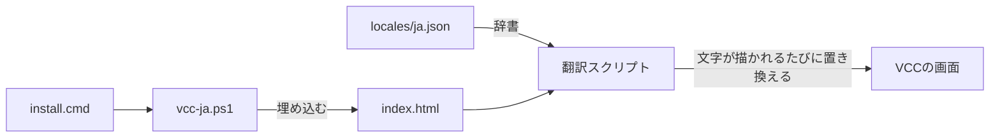

# VCC日本語化パッチ（非公式）

VRChat Creator Companion（VCC）の画面を日本語で表示する、非公式のパッチです。
VCC本体のプログラムとJSには手を加えません。
画面の入り口である`index.html`に、翻訳用のスクリプトを埋め込みます。

## 1. 概要

- VCC 2.4.5で動作を確認しています。
- VCCの画面に出てくる文字列（約500件）を訳します。
- 辞書は英語の文言をキーにしています。VCCが更新されても、文言が同じ箇所はそのまま訳されます。
- 辞書にない文字列は英語のまま表示されます。

次のものは英語のまま残します。

- パッケージ名とパッケージの説明（リポジトリ側のデータ）
- リポジトリ名（Official、Curated、Local User Packages）
- ログの本文
- VCCのサーバー側から届く一部のメッセージ

## 2. 注意事項

- VRChatが提供するものではありません。VRChatのサポート対象外です。
- VRChatの利用規約は、VRChatが提供するソフトウェアの改変を制限しています。
- 使うのは自分のPCの中だけにしてください。パッチを当てたVCCのファイルは配布しないでください。
- VCCをアップデートすると`index.html`が置き換わり、パッチが外れます。アップデートのあとは、もう一度インストールしてください。
- VCCの不具合を報告するときは、パッチを外して英語表示でも起きるか確かめてください。

## 3. 使い方

### 3.1. インストール

1. [リリースの一覧](https://github.com/223n/vcc-localization/releases)から、最新版の「Source code (zip)」を取得して展開します。
1. VCCを終了します。
1. `install.cmd`をダブルクリックします。
1. VCCを起動します。

VCCを起動したままインストールした場合は、VCCを再起動すると反映されます。

### 3.2. アンインストール

1. `uninstall.cmd`をダブルクリックします。
1. VCCを再起動します。

### 3.3. 状態の確認

```powershell
powershell -NoProfile -ExecutionPolicy Bypass -File vcc-ja.ps1 -Action status
```

VCCを既定以外の場所にインストールしている場合は、`-VccPath`でインストール先を指定します。

## 4. 仕組み

VCCの画面は、VCCに内蔵されたWebサーバーが配信するReactアプリです。
`vcc-ja.ps1`は、その入り口の`WebApp\Dist\index.html`に翻訳スクリプト、辞書、補正用のCSSを埋め込みます。
元の`index.html`は`index.html.vcc-ja.bak`として残します。



翻訳スクリプトは、画面に文字が描かれるたびに辞書と照合し、日本語に置き換えます。
VCCのJSバンドルは変更しません。
翻訳スクリプトの読み込みに失敗しても、VCCは英語表示のまま動作します。

## 5. 開発

### 5.1. 必要なもの

- Node.js 24以降（開発用ツールと検査で使います。インストールには不要です）
- PowerShell 7以降（`npm test`で使います）
- Windows PowerShell 5.1（`install.cmd`が使います。Windowsに最初から入っています）

最初に依存を入れます。

```powershell
npm install
```

### 5.2. 検査

```powershell
npm run lint
npm test
```

- `npm run lint`: 日本語の文書を`markdownlint`と`textlint`で検査します。
- `npm test`: スクリプトの構文、辞書の形、インストーラーの埋め込みと取り外しを検査します。

`npm test`は、偽のVCCフォルダーを一時的に作って動かします。
本物のVCCには触りません。
Pull Requestでは、CIが同じ検査に加えて、ワークフローも検査します。
CodeQLは、ワークフローとJavaScriptを走査します。

### 5.3. 辞書の編集

`locales/ja.json`の`sections`に、画面ごとの訳を書きます。

- `exact`: 英語の文言と訳の組です。前後の空白を除いた文言で照合します。
- `patterns`: 正規表現と置換後の文字列の組です。`$1`で一致した部分を使えます。
- `skip`: 翻訳しない要素のCSSセレクターです。ログ一覧を指定しています。

訳文の端が全角の場合、原文の前後にあった空白は取り除きます。
全角と半角の間に空白を入れない表記に合わせるためです。

### 5.4. VCCへ書き込まずに確認する

```powershell
npm run dev
```

ブラウザーで<http://localhost:5480/>を開くと、日本語化した画面を確認できます。
画面のファイルは、VCCのインストール先から読み取るだけです。
VCCのAPIへは読み取りの要求だけを中継し、設定の変更などの操作は送りません。

- `http://localhost:5480/?raw`を開くと、英語のまま表示します。
- ポート番号を変える場合は、`.env.example`を`.env`にコピーして`PORT`を書き換えます。

ブラウザーのコンソールで次を実行すると、文の断片をつなぐ処理を自動で確認できます。

```javascript
await eval(await (await fetch('/__vccja/selftest.js')).text())
```

### 5.5. VCCを更新したときの確認

```powershell
npm run coverage
```

辞書にない画面の文字列と、VCCから消えた辞書のキーを一覧にします。
文字列の候補をすべて見る場合は、`npm run extract`を実行します。
結果は`work/strings.json`に出ます。

### 5.6. 開発の流れ

GitFlowに沿って運用します。
`develop`から`feature/変更の名前`ブランチを切り、`develop`へのPull Requestをマージコミットでマージします。
ブランチの役割とPull Requestの決まりは[CONTRIBUTING.md](CONTRIBUTING.md)にあります。

リリースは次の手順で行います。

1. Actionsの「リリース」を開き、「Run workflow」を選びます。
1. `version`にリリースする版を入れます。`v`は付けません（例: `0.1.0`）。
1. ワークフローが`release/vX.Y.Z`ブランチを切り、`main`へのPull Requestを開きます。
1. Pull Requestの内容を確かめ、マージコミットでマージします。
1. 「リリースを公開する」ワークフローがタグとGitHub Releaseを作ります。

版は`package.json`の`version`で管理します。
公開のあと、ワークフローは`main`を`develop`に戻します。

## 6. ファイル構成

- `install.cmd`、`uninstall.cmd`: ダブルクリックで実行する入り口
- `vcc-ja.ps1`: インストール、アンインストール、状態の確認
- `locales/ja.json`: 翻訳の辞書
- `src/translator.js`: 実行時に画面を翻訳するスクリプト
- `src/style.css`: 日本語にしたことで崩れるレイアウトの補正
- `tools/dev-server.mjs`: VCCへ書き込まずに確認するためのサーバー
- `tools/selftest.js`: 翻訳スクリプトの動作確認（ブラウザーで実行）
- `tools/test.mjs`、`tools/fixtures/`: `npm test`の検査と、そこで使うファイル
- `tools/check-coverage.mjs`: 辞書の網羅状況の確認
- `tools/extract-strings.mjs`: VCCのJSから画面の文字列の候補を抽出
- `.github/`: CI、CodeQL、ラベル、Issueのフォーム、Dependabot、リリース
- `CONTRIBUTING.md`: 貢献の手引き
- `CLAUDE.md`: Claude Codeが読む決まり
- `SECURITY.md`: 脆弱性の報告先

## 7. ライセンス

コードと日本語訳は[MITライセンス](LICENSE)で公開しています。
`locales/ja.json`に含まれる英語の文字列は、VRChat Creator Companionから抜き出したものです。
権利はVRChat社に帰属し、MITライセンスの対象外です。
詳しくは[NOTICE](NOTICE)を参照してください。
